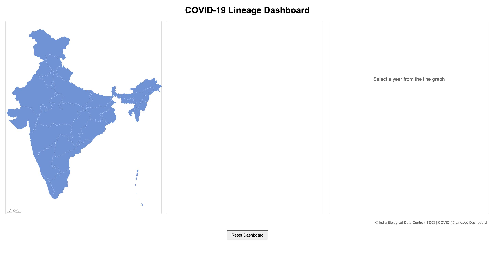
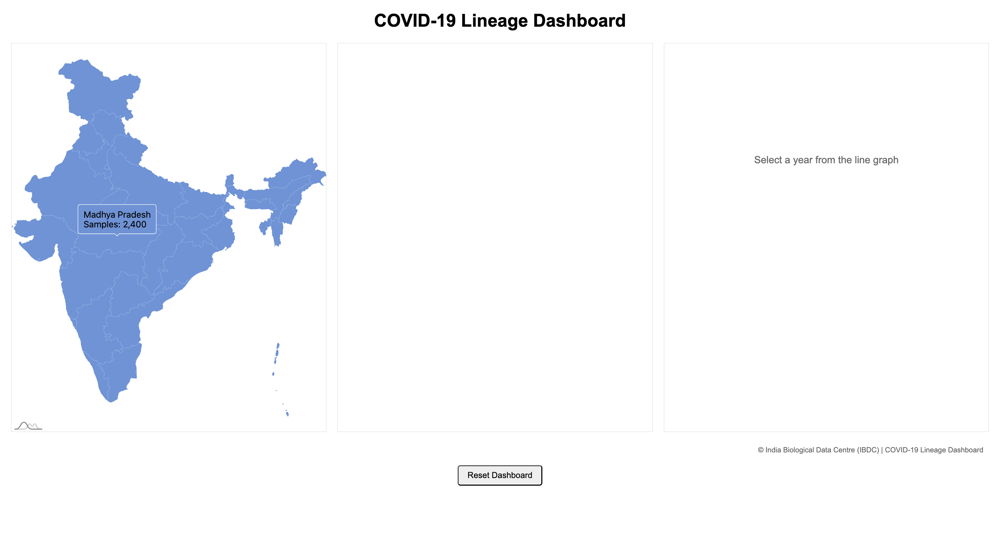
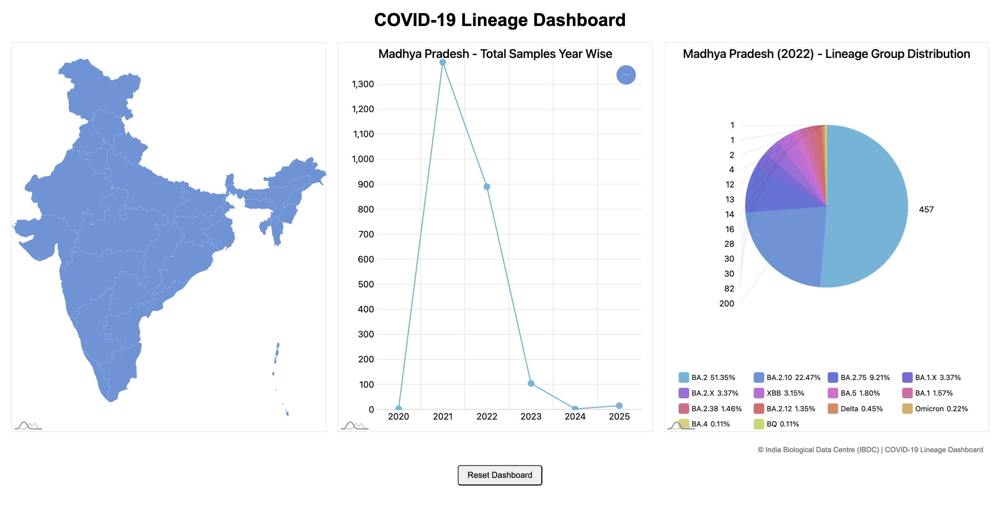
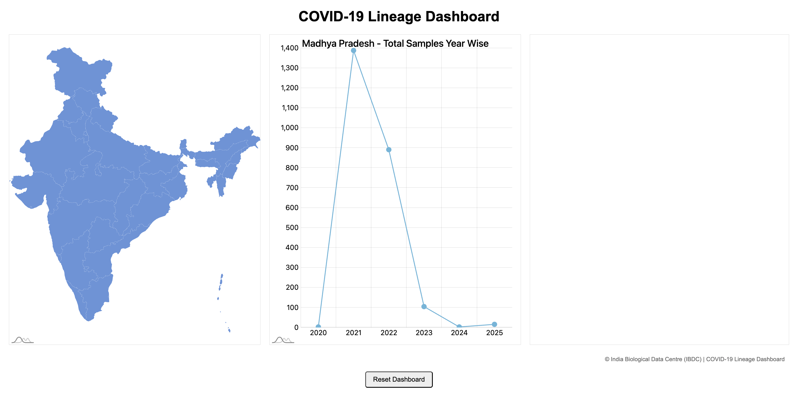

# COVID Lineage Dashboard

A dynamic web dashboard developed during my internship to visualize COVID-19 lineage data using interactive charts and maps.

---

## Features

- Interactive COVID lineage visualization
- Dynamic charts using amCharts
- World map visualization
- Year-wise lineage analysis
- Real-time data fetching using PHP and MySQL
- Responsive user interface

---

## Tech Stack

- PHP
- MySQL
- HTML5
- CSS3
- JavaScript
- amCharts

---

## Project Structure

```
Project 2/
│
├── Data/
│   ├── insacogdata-open-lineage.csv
│   └── lineage-group.csv
│
├── Database/
│   └── covid_db.sql
│
├── Screenshots/
│
├── db.php
├── index.php
├── lineage_data.php
├── map_data.php
├── year_data.php
├── script.js
└── style.css
```

---

## Installation

### 1. Clone the repository

```bash
git clone https://github.com/Gaurav-102005/COVID-Lineage-Dashboard.git
```

### 2. Import the database

Import

```
Database/covid_db.sql
```

into MySQL.

### 3. Update database credentials

Open `db.php` and update:

```php
$host = "localhost";
$user = "your_username";
$password = "your_password";
$database = "covid_db";
```

### 4. Run the PHP server

```bash
php -S localhost:8000
```

Then open

```
http://localhost:8000
```

---

## Screenshots

## Dashboard



## World Map



## Lineage Chart



## Yearly Analysis



---

## Author

**Gaurav Bhaskar**

Computer Science Engineering Student

Portfolio:
https://gaurav-102005.github.io/My-Portfolio/

LinkedIn:
https://www.linkedin.com/in/gaurav-bhaskar-13366433b/

GitHub:
https://github.com/Gaurav-102005